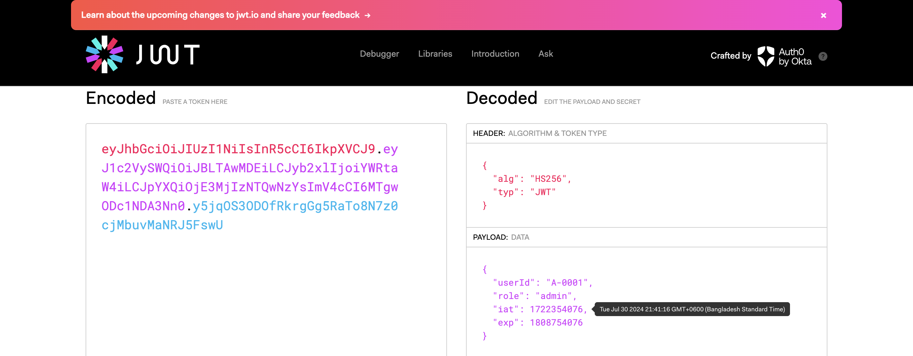

# React + TypeScript + Vite +Redux+RTK

[client](http://localhost:5173/)
npm install
npm run dev 

[server](http://localhost:5173/)
npm install
npm run dev 

###    install packages:
react-hook-form 
### Steps:

- Make Base Api
- make the auth

### Steps:

- **Part-4:**
    - 1.Working on User Management
    - 2.Refactor Form Component
    - 3.Make Reusable Select Component
    - 4.Handle Create Academic Semester Form

- **Part-2A-Authentication-Token:**
    - 7.Make Form Wrapper [Form Provider Props](https://react-hook-form.com/docs/formprovider)
    - 8.Share Form Context using Form Provider
    - 9.Binding input with controller in login part
    - 10.Handle Form default value
    - 1.install `sonner toast.`
    - 2.Login and `redirect` to role based route 
    - 3.Setting up base Query and send AccessToken with each request 
    - 4.[Verify jwt and set up custom Base Query](https://redux-toolkit.js.org/rtk-query/usage/customizing-queries)
    - 5. Retrived new AccessToken (not working)
    - 6. Handle expired RefreshToken (not working) 

- **Part-2-Authentication:**
    - Make Base Api
    - make the auth
    - Basic login form using react-hook-form
    - set cookies in the browser 
    - Decode token and set user in local state
    - integrate redux persistence
    - implement private route

- **Part-1-BasicUI:**
    - Role based routing