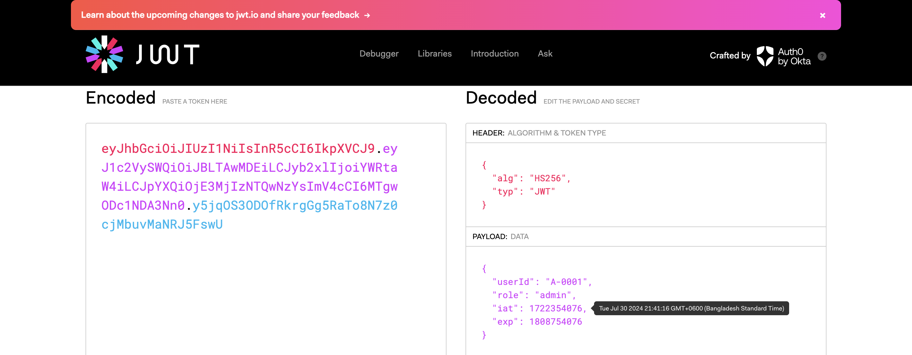

# React + TypeScript + Vite +Redux+RTK

[client](http://localhost:5173/)
npm install
npm run dev 

[server](http://localhost:5173/)
npm install
npm run dev 

###    install packages:
react-hook-form 
### Steps:

- Make Base Api
- make the auth

### Steps:

- **Part-7:**
    - 1. Handle Offered Course dependent selected part
    - 2. Handle Role Based Authentication
    - 3. Handle Patch Security Issue
    - 4. Force password change for the first time
    - 5. Handle Student Offered Course part (fix the data fetching)
- **Part-6:**
    - 1. Handle Semester Registration
    - 2. Semester Registration Table
    - 3. Handle Status change dropdown
    - 4. Register  Semester Update Status
    - 5. Handle Cache of Semester Registration
    - 6. `Course` handle multiple select options
    - 7. `Course` Create Course
    - 8. `Course` Handle Modal
    - 9. `Course` add faculty modal
    - 10. `Offered Course` add faculty working with dependent selet with watch
    - 11. `Offered Course` disable input based on another input

- **Part-5:**
    - 1. Get Data Using Form Data Api
    - 2. Basic Form Structure for Student
    - 3. Date picker and Dynamic Options for Student Data
    - 4 Parallel query and dependent query handle postdata
    - 5 Handle Image Upload part.
    - 6 Show Student Data.
    - 7 Fix fronted page limit pagination.
    - 8 Fix student data pagination part
    - 9 Making dynamic route for student details page.
    - 10 Add dynamic route for student details and show data [`update is not done`]

- **Part-4:**
    - 1.Working on User Management
    - 2.Refactor Form Component
    - 3.Make Reusable Select Component
    - 4.Handle Create Academic Semester Form
    - 5. Froneted Form Validation useing zod  `npm install zod @hookform/resolvers`
    - 6. Academic Semester RTK Query Mutation
    - 7. Resolved Type error in `global.ts`
    - 8. Show Academic Semester Table Data
    - 9. Resolved Type errors of Redux Response
    - 10. Generic Type for response data
    - 11. Handle Table Filter in Redux params
    - 12. Wrap module
-- Create Faculty
-- Create Department

- **Part-2A-Authentication-Token:**
    - 7.Make Form Wrapper [Form Provider Props](https://react-hook-form.com/docs/formprovider)
    - 8.Share Form Context using Form Provider
    - 9.Binding input with controller in login part
    - 10.Handle Form default value
    - 1.install `sonner toast.`
    - 2.Login and `redirect` to role based route 
    - 3.Setting up base Query and send AccessToken with each request 
    - 4.[Verify jwt and set up custom Base Query](https://redux-toolkit.js.org/rtk-query/usage/customizing-queries)
    - 5. Retrived new AccessToken (not working)
    - 6. Handle expired RefreshToken (not working) 

- **Part-2-Authentication:**
    - Make Base Api
    - make the auth
    - Basic login form using react-hook-form
    - set cookies in the browser 
    - Decode token and set user in local state
    - integrate redux persistence
    - implement private route

- **Part-1-BasicUI:**
    - Role based routing